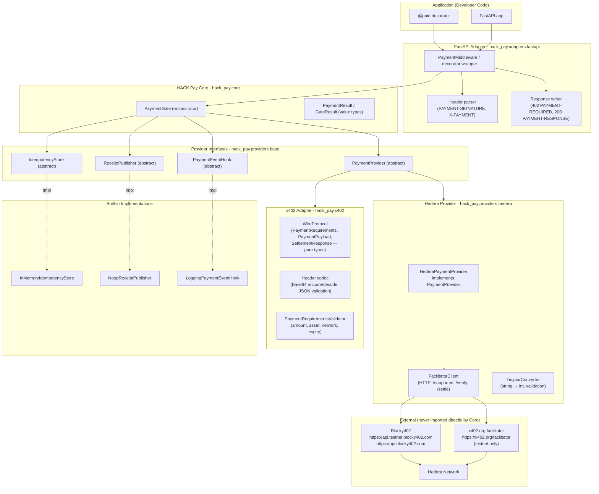
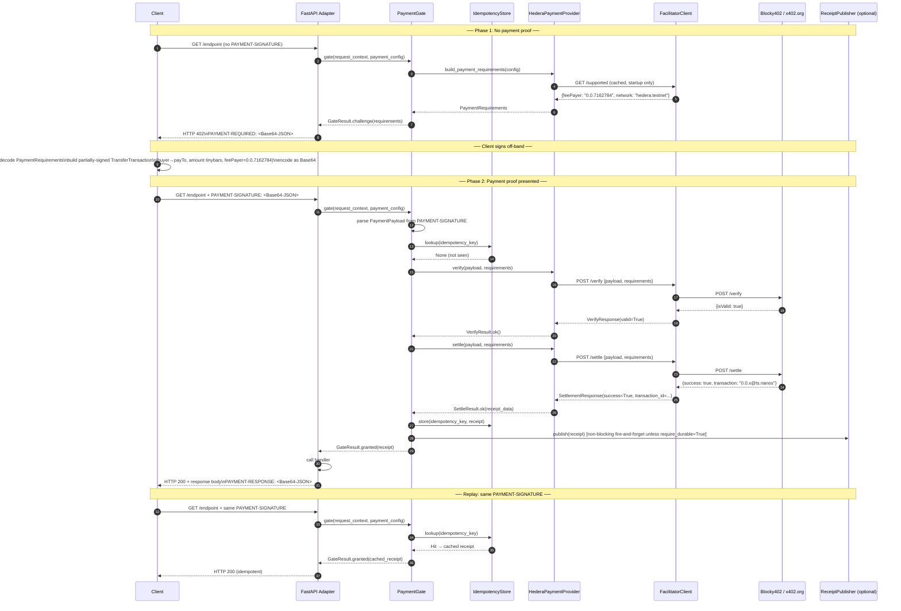

# Design Document: HACK.Pay v0.1

**Status:** Draft — Pending Requirements  
**Version:** 0.1.0  
**Date:** September 2026  

---

## Table of Contents

1. [Overview](#1-overview)
2. [Architecture](#2-architecture)
3. [Public API](#3-public-api)
4. [Data Models](#4-data-models)
5. [Provider Interface](#5-provider-interface)
6. [x402 Integration Boundary](#6-x402-integration-boundary)
7. [Hedera Payment Provider](#7-hedera-payment-provider)
8. [Idempotency](#8-idempotency)
9. [Receipt Abstraction](#9-receipt-abstraction)
10. [Configuration](#10-configuration)
11. [Observability Hooks](#11-observability-hooks)
12. [FastAPI Adapter](#12-fastapi-adapter)
13. [Error Hierarchy](#13-error-hierarchy)
14. [Security — Threat Model](#14-security--threat-model)
15. [Test Architecture](#15-test-architecture)
16. [Package Structure](#16-package-structure)
17. [Implementation Notes](#17-implementation-notes)
18. [Correctness Properties](#18-correctness-properties)
19. [Documentation Plan](#19-documentation-plan)

---

## 1. Overview

### 1.1 What This Is

HACK.Pay v0.1 is a **Python payment-gate library** that lets a FastAPI developer add per-request HBAR micropayments to any endpoint with a single decorator:

```python
@app.get("/weather")
@paid("0.5 HBAR")
async def get_weather(city: str):
    return {"forecast": "sunny"}
```

When a client calls `/weather` without a payment proof, the server returns HTTP 402 with a `PAYMENT-REQUIRED` header. The client signs a Hedera `TransferTransaction`, retries with the `PAYMENT-SIGNATURE` header, and receives the response. The entire flow conforms to the **x402 open protocol v2** with Hedera as the payment network.

### 1.2 Design Label Key

- **[FACT]** — Verified from live sources (Hedera docs, x402-foundation/x402 repo, PyPI, x402-payments skill)
- **[ASSUMPTION]** — Reasonable inference; must be validated before final implementation
- **[PROPOSAL]** — A design choice made here; can be changed with justification
- **[REQUIRES VERIFICATION]** — Not yet confirmed; implementation must verify

### 1.3 Scope of v0.1

**In scope:** HACK.Pay core, x402 integration boundary, Hedera provider (Blocky402), FastAPI adapter, idempotency abstraction, receipt abstraction, configuration, observability hooks, comprehensive tests, documentation, minimal example.

**Out of scope:** Registry, discovery, marketplace, developer accounts, WalletConnect, agent identity, compliance certification, trust scores, HCS certificate infrastructure, fiat rails, multi-chain beyond Hedera.

### 1.4 Core Design Principles

1. **Decorator-first UX.** `@paid("0.5 HBAR")` is the entire integration surface for 90% of developers.
2. **Hard dependency layering.** `FastAPI Adapter → Core → Provider Interface → x402 Adapter → Hedera impl → Facilitator`. No layer imports from a layer above it.
3. **Optional components cannot break required flows.** A broken `ReceiptPublisher` must never prevent a legitimate paid request from succeeding unless `require_durable_receipt=True`.
4. **Idempotency is first-class.** Duplicate payment proofs are safe by design.
5. **Security is an explicit design artifact.** Every threat in §14 has a code-level mitigation.
6. **Testability without a network.** All external calls are behind interfaces. Unit tests never contact Hedera.

---

## 2. Architecture

### 2.1 Layer Diagram



### 2.2 Dependency Rule Enforcement

```
hack_pay.adapters.fastapi   → imports hack_pay.core
hack_pay.core               → imports hack_pay.providers.base, hack_pay.x402.types, hack_pay.errors
hack_pay.providers.base     → imports hack_pay.x402.types, hack_pay.errors
hack_pay.providers.hedera   → imports hack_pay.providers.base, hack_pay.x402.types
hack_pay.x402               → imports only stdlib + pydantic
hack_pay.errors             → imports only stdlib
```

**Prohibited imports (enforced via import-linter in CI):**
- `hack_pay.core` must never import `fastapi`, `starlette`, or anything from `hack_pay.adapters`
- `hack_pay.providers.base` must never import `fastapi`
- `hack_pay.x402` must never import `hiero_sdk`, `hedera_sdk`, or `httpx` (pure types only)
- `hack_pay.providers.hedera.facilitator` is the only module that performs outbound HTTP calls

### 2.3 Payment Flow



---

## 3. Public API

### 3.1 Primary Decorator

```python
from hack_pay import paid

@app.get("/premium-data")
@paid("0.5 HBAR")
async def premium_data():
    return {"data": "..."}
```

**[PROPOSAL]** `@paid` string format: `"N HBAR"` where N is a decimal. Parsed to tinybars as `int(N * 100_000_000)`. Integer arithmetic only — never float for tinybar values.

### 3.2 App Registration

```python
from hack_pay import HackPay, HackPayConfig
from hack_pay.providers.hedera import HederaPaymentProvider, HederaProviderConfig

provider = HederaPaymentProvider(
    HederaProviderConfig(
        network="hedera:testnet",           # CAIP-2 identifier [FACT]
        receiver_account_id="0.0.12345",   # payTo account
        facilitator_url="https://api.testnet.blocky402.com",  # Blocky402 testnet [FACT]
        facilitator_timeout_seconds=10,
    )
)

hack = HackPay(HackPayConfig(provider=provider))
hack.init_app(app)
```

### 3.3 PaymentConfig (per-endpoint)

```python
@dataclass(frozen=True)
class PaymentConfig:
    amount_tinybars: int                 # always integer tinybars; 1 HBAR = 100_000_000
    asset: str = "0.0.0"               # "0.0.0" = native HBAR [FACT]; HTS token entity ID otherwise
    network: str = "hedera:testnet"     # CAIP-2 [FACT]
    description: str = ""
    max_deadline_seconds: int = 300
    require_durable_receipt: bool = False
```

### 3.4 Public Surface (all of hack_pay/__init__.py)

```python
# Everything a developer ever needs to import
from hack_pay import (
    paid,               # decorator
    HackPay,            # app wrapper
    HackPayConfig,      # global config
    PaymentConfig,      # per-endpoint config
    PaymentReceipt,     # receipt value type
    HackPayError,       # base error class
    InsufficientPaymentError,
    InvalidPaymentError,
    FacilitatorError,
)
from hack_pay.providers.hedera import (
    HederaPaymentProvider,
    HederaProviderConfig,
)
from hack_pay.idempotency import InMemoryIdempotencyStore
```

Everything else is internal.

---

## 4. Data Models

All models are **immutable dataclasses or Pydantic models** depending on whether they cross a serialization boundary.

### 4.1 x402 Wire Types (hack_pay.x402.types)

**[FACT]** These mirror the x402 v2 spec exactly.

```python
from pydantic import BaseModel

class PaymentRequirements(BaseModel):
    """Sent by server in PAYMENT-REQUIRED header."""
    scheme: str                  # "exact"
    network: str                 # "hedera:testnet" or "hedera:mainnet"
    pay_to: str                  # Hedera account id "0.0.XXXXX"
    amount: str                  # tinybars as decimal string e.g. "50000000"
    asset: str                   # "0.0.0" for HBAR, HTS entity id for tokens
    description: str = ""
    mime_type: str = ""
    max_deadline_seconds: int = 300
    extra: dict = {}             # facilitator feePayer lives here for Hedera scheme [FACT]

class PaymentPayload(BaseModel):
    """Sent by client in PAYMENT-SIGNATURE header."""
    x402_version: int = 2        # [FACT] v2
    scheme: str                  # "exact"
    network: str                 # "hedera:testnet"
    payload: str                 # Base64-encoded partially-signed TransferTransaction bytes [FACT]

class SettlementResponse(BaseModel):
    """Returned by facilitator after successful settle; echoed in PAYMENT-RESPONSE header."""
    success: bool
    transaction: str | None = None   # Hedera transaction id "0.0.X@ts.nanos"
    network: str | None = None
    payer: str | None = None
    error: str | None = None
```

### 4.2 PaymentReceipt (hack_pay.receipts.types)

**[PROPOSAL]** Contains only information justified by the actual payment protocol.

```python
@dataclass(frozen=True)
class PaymentReceipt:
    transaction_id: str          # Hedera transaction id from settlement
    payer_account_id: str | None # extracted from TransferTransaction if available
    receiver_account_id: str     # payTo from PaymentRequirements
    amount_tinybars: int         # validated integer tinybars
    asset: str                   # "0.0.0" for HBAR
    network: str                 # "hedera:testnet" or "hedera:mainnet"
    settled_at: datetime         # UTC timestamp of settlement confirmation
    facilitator_url: str         # which facilitator settled this
```

### 4.3 GateResult (hack_pay.core.types)

```python
from dataclasses import dataclass
from typing import Literal

@dataclass(frozen=True)
class ChallengeResult:
    kind: Literal["challenge"]
    requirements: PaymentRequirements

@dataclass(frozen=True)
class GrantedResult:
    kind: Literal["granted"]
    receipt: PaymentReceipt

@dataclass(frozen=True)
class ErrorResult:
    kind: Literal["error"]
    error: "HackPayError"

GateResult = ChallengeResult | GrantedResult | ErrorResult
```

### 4.4 FacilitatorSupportedResponse (hack_pay.providers.hedera.types)

**[FACT]** Mirrors `GET /supported` response shape from Blocky402 and x402.org.

```python
@dataclass(frozen=True)
class SupportedKind:
    scheme: str           # "exact"
    network: str          # "hedera:testnet"
    fee_payer: str        # fee-payer account id e.g. "0.0.7162784" [FACT Blocky402 testnet]

@dataclass(frozen=True)
class FacilitatorSupportedResponse:
    kinds: list[SupportedKind]
```

---

## 5. Provider Interface

```python
# hack_pay/providers/base.py
from abc import ABC, abstractmethod

class PaymentProvider(ABC):
    """
    Abstraction over a payment network + facilitator pair.
    Knows how to build payment requirements and verify/settle payments.
    Stateless across requests; safe to call concurrently.
    """

    @abstractmethod
    async def build_payment_requirements(
        self,
        config: PaymentConfig,
    ) -> PaymentRequirements:
        """
        Build the PaymentRequirements to include in the 402 response.
        Must include feePayer in extra for Hedera scheme.
        """

    @abstractmethod
    async def verify(
        self,
        payload: PaymentPayload,
        requirements: PaymentRequirements,
    ) -> VerifyResult:
        """
        Ask the facilitator to verify the signed payment payload.
        Must NOT submit any transaction to the network.
        """

    @abstractmethod
    async def settle(
        self,
        payload: PaymentPayload,
        requirements: PaymentRequirements,
    ) -> SettleResult:
        """
        Ask the facilitator to co-sign, submit, and await SUCCESS.
        Returns the Hedera transaction id on success.
        Must be idempotent at the facilitator level.
        """
```

**[PROPOSAL]** `verify` and `settle` are separate calls — they are not the same operation and their failure semantics differ. Verify can be retried freely; settle must be idempotent at the facilitator.

---

## 6. x402 Integration Boundary

### 6.1 What the x402 Adapter Does

The `hack_pay.x402` module is a **pure types + codec layer**. It has no HTTP calls and no blockchain interaction. Its job:

1. Define the Python equivalents of x402 v2 wire types (§4.1)
2. Parse `PAYMENT-SIGNATURE` header: Base64-decode → JSON validate → `PaymentPayload`
3. Serialize `PaymentRequirements` → JSON → Base64 → `PAYMENT-REQUIRED` header value
4. Validate payment requirements structure (scheme, network prefix, amount format, asset format)
5. Validate payment payload structure (x402Version must be 2, scheme must match)

### 6.2 Why Not Use the Python x402 Package's Hedera Extra

**[FACT]** The PyPI `x402` package (v2.22.0) provides extras: `[evm]`, `[svm]`, `[tvm]` — **no `[hedera]` extra exists in Python**. The Hedera scheme is implemented in the TypeScript `@x402/hedera` package only.

**[FACT]** The facilitators expose a plain HTTP API (`GET /supported`, `POST /verify`, `POST /settle`). No chain-specific SDK is needed on the resource server side — the facilitator handles all Hedera SDK interaction.

**[PROPOSAL]** Architecture decision: **Option C — thin Python Hedera provider calling facilitator HTTP API directly**.

```
HederaPaymentProvider
  → FacilitatorClient (pure httpx async)
    → POST https://api.testnet.blocky402.com/verify
    → POST https://api.testnet.blocky402.com/settle
```

This means:
- No Hedera SDK dependency in the resource server (`hiero-sdk-python` is NOT required)
- Clean, testable, mockable HTTP boundary
- Identical pattern to how the TypeScript `x402ResourceServer` works under the hood

We do **optionally** depend on `hiero-sdk-python` for the testnet test client that generates test payment proofs. This dependency is in the `[testnet]` optional extra only.

### 6.3 Header Codec

```python
# hack_pay/x402/codec.py

import base64
import json
from hack_pay.x402.types import PaymentRequirements, PaymentPayload, SettlementResponse

def encode_payment_required(req: PaymentRequirements) -> str:
    """Serialize PaymentRequirements to PAYMENT-REQUIRED header value."""
    return base64.b64encode(req.model_dump_json().encode()).decode()

def decode_payment_signature(header_value: str) -> PaymentPayload:
    """
    Parse PAYMENT-SIGNATURE header value.
    Raises InvalidPaymentError on malformed input.
    Max header size: 64 KB enforced before decode.
    """
    if len(header_value) > 65536:
        raise OversizedPaymentHeaderError(f"PAYMENT-SIGNATURE exceeds 64 KB limit")
    try:
        raw = base64.b64decode(header_value.encode(), validate=True)
        data = json.loads(raw)
    except Exception as e:
        raise MalformedPaymentError(f"Cannot decode PAYMENT-SIGNATURE: {e}") from e
    return PaymentPayload.model_validate(data)

def encode_payment_response(settlement: SettlementResponse) -> str:
    """Serialize SettlementResponse to PAYMENT-RESPONSE header value."""
    return base64.b64encode(settlement.model_dump_json().encode()).decode()
```

### 6.4 x402 v1 Legacy Header Handling

```python
def extract_payment_header(headers: dict[str, str]) -> tuple[str, int]:
    """
    Returns (header_value, version).
    v2: PAYMENT-SIGNATURE
    v1: X-PAYMENT (legacy — rejected with UnsupportedProtocolVersionError)
    """
    if v2 := headers.get("payment-signature"):
        return v2, 2
    if v1 := headers.get("x-payment"):
        raise UnsupportedProtocolVersionError(
            "x402 v1 (X-PAYMENT header) is not supported. Use v2 PAYMENT-SIGNATURE."
        )
    return "", 0
```

---

## 7. Hedera Payment Provider

### 7.1 Facilitators

**[FACT]** Two public facilitators support Hedera:

| Facilitator | Testnet URL | Mainnet URL | Fee Payer (testnet) | Fee Payer (mainnet) |
|-------------|-------------|-------------|---------------------|---------------------|
| **Blocky402** (recommended) | `https://api.testnet.blocky402.com` | `https://api.blocky402.com` | `0.0.7162784` | `0.0.10571514` |
| x402.org | `https://x402.org/facilitator` | — (testnet only) | `0.0.9185802` | N/A |

**[PROPOSAL]** Default to Blocky402 testnet URL. Users switch to Blocky402 mainnet for production. x402.org is documented as a dev/quickstart alternative.

### 7.2 HederaPaymentProvider Implementation

```python
# hack_pay/providers/hedera/provider.py

class HederaPaymentProvider(PaymentProvider):
    """
    Implements PaymentProvider for Hedera using a public x402 facilitator.

    The resource server never holds a private key or Hedera SDK.
    All on-chain work is delegated to the facilitator.
    """

    def __init__(self, config: HederaProviderConfig) -> None:
        self._config = config
        self._client = FacilitatorClient(
            base_url=config.facilitator_url,
            timeout_seconds=config.facilitator_timeout_seconds,
        )
        self._fee_payer: str | None = None  # fetched once at startup

    async def initialize(self) -> None:
        """
        Fetch /supported from the facilitator and cache the feePayer.
        Must be called once before first request.
        Raises FacilitatorUnavailableError if the facilitator is unreachable.
        """
        supported = await self._client.get_supported()
        matching = [
            k for k in supported.kinds
            if k.network == self._config.network and k.scheme == "exact"
        ]
        if not matching:
            raise FacilitatorNetworkNotSupportedError(
                f"Facilitator {self._config.facilitator_url} does not support "
                f"network={self._config.network} scheme=exact"
            )
        self._fee_payer = matching[0].fee_payer

    async def build_payment_requirements(
        self,
        config: PaymentConfig,
    ) -> PaymentRequirements:
        if self._fee_payer is None:
            raise RuntimeError("HederaPaymentProvider.initialize() was not called")
        return PaymentRequirements(
            scheme="exact",
            network=self._config.network,
            pay_to=self._config.receiver_account_id,
            amount=str(config.amount_tinybars),    # [FACT] string decimal tinybars
            asset=config.asset,                    # "0.0.0" for HBAR [FACT]
            description=config.description,
            max_deadline_seconds=config.max_deadline_seconds,
            extra={"feePayer": self._fee_payer},   # [FACT] required by Hedera scheme
        )

    async def verify(
        self,
        payload: PaymentPayload,
        requirements: PaymentRequirements,
    ) -> VerifyResult:
        try:
            resp = await self._client.verify(payload, requirements)
        except FacilitatorTimeoutError:
            raise
        except FacilitatorError:
            raise
        if not resp.is_valid:
            return VerifyResult.fail(resp.error or "Facilitator rejected payment")
        return VerifyResult.ok()

    async def settle(
        self,
        payload: PaymentPayload,
        requirements: PaymentRequirements,
    ) -> SettleResult:
        try:
            resp = await self._client.settle(payload, requirements)
        except FacilitatorTimeoutError:
            raise
        except FacilitatorError:
            raise
        if not resp.success:
            return SettleResult.fail(resp.error or "Settlement failed")
        return SettleResult.ok(
            transaction_id=resp.transaction,
            payer=resp.payer,
        )
```

### 7.3 FacilitatorClient

```python
# hack_pay/providers/hedera/facilitator.py

import httpx

class FacilitatorClient:
    """
    Thin async HTTP client for the x402 facilitator API.
    All outbound HTTP in HACK.Pay goes through this class.

    Endpoints [FACT]:
      GET  /supported  → FacilitatorSupportedResponse
      POST /verify     → FacilitatorVerifyResponse
      POST /settle     → SettlementResponse
      GET  /health     → {"status": "ok"}
    """

    def __init__(self, base_url: str, timeout_seconds: int = 10) -> None:
        self._base_url = base_url.rstrip("/")
        self._timeout = httpx.Timeout(timeout_seconds)
        # Single shared client — reused across requests [PROPOSAL: reuse safe]
        self._http = httpx.AsyncClient(
            base_url=self._base_url,
            timeout=self._timeout,
            limits=httpx.Limits(max_connections=20, max_keepalive_connections=10),
        )

    async def get_supported(self) -> FacilitatorSupportedResponse:
        resp = await self._http.get("/supported")
        resp.raise_for_status()
        return FacilitatorSupportedResponse.model_validate(resp.json())

    async def verify(
        self,
        payload: PaymentPayload,
        requirements: PaymentRequirements,
    ) -> FacilitatorVerifyResponse:
        body = {
            "payload": payload.model_dump(),
            "requirements": requirements.model_dump(),
        }
        resp = await self._http.post("/verify", json=body)
        _map_facilitator_error(resp)
        return FacilitatorVerifyResponse.model_validate(resp.json())

    async def settle(
        self,
        payload: PaymentPayload,
        requirements: PaymentRequirements,
    ) -> SettlementResponse:
        body = {
            "payload": payload.model_dump(),
            "requirements": requirements.model_dump(),
        }
        resp = await self._http.post("/settle", json=body)
        _map_facilitator_error(resp)
        return SettlementResponse.model_validate(resp.json())

    async def health_check(self) -> bool:
        try:
            resp = await self._http.get("/health", timeout=3.0)
            return resp.status_code == 200
        except Exception:
            return False

    async def close(self) -> None:
        await self._http.aclose()
```

**SSRF protection — [PROPOSAL]:** The `facilitator_url` is validated at configuration load time against an allowlist pattern. Arbitrary URLs from request input are never used.

```python
import re

_SAFE_URL_PATTERN = re.compile(r"^https://[a-zA-Z0-9.\-]+(:\d+)?(/.*)?$")

def validate_facilitator_url(url: str) -> str:
    if not _SAFE_URL_PATTERN.match(url):
        raise ConfigurationError(
            f"facilitator_url must be an HTTPS URL. Got: {url!r}"
        )
    return url
```

### 7.4 Amount Handling

**[FACT]** Hedera x402 uses tinybars (integers). HBAR is 1 × 10^8 tinybars.

```python
# hack_pay/providers/hedera/amounts.py

from decimal import Decimal, InvalidOperation
import re

TINYBAR_PER_HBAR = 100_000_000
_HBAR_PATTERN = re.compile(r"^(\d+(?:\.\d{1,8})?) HBAR$", re.IGNORECASE)

def parse_hbar_string(value: str) -> int:
    """
    Parse "0.5 HBAR" → 50_000_000 tinybars.
    Uses Decimal arithmetic — never float.
    Raises ValueError on invalid format or more than 8 decimal places.
    """
    m = _HBAR_PATTERN.match(value.strip())
    if not m:
        raise ValueError(
            f"Invalid HBAR amount format: {value!r}. Expected e.g. '0.5 HBAR'."
        )
    try:
        d = Decimal(m.group(1))
    except InvalidOperation as e:
        raise ValueError(f"Cannot parse amount: {value!r}") from e
    # Shift 8 decimal places and convert to int
    tinybars = int(d * TINYBAR_PER_HBAR)
    # Verify round-trip (guards against float imprecision leaking through)
    if Decimal(tinybars) != d * TINYBAR_PER_HBAR:
        raise ValueError(f"Amount {value!r} has more than 8 decimal places")
    if tinybars <= 0:
        raise ValueError(f"Payment amount must be positive, got: {tinybars}")
    return tinybars
```

### 7.5 Receiver Account Validation

```python
import re

_HEDERA_ACCOUNT_PATTERN = re.compile(r"^\d+\.\d+\.\d+$")

def validate_hedera_account_id(account_id: str) -> str:
    if not _HEDERA_ACCOUNT_PATTERN.match(account_id):
        raise ConfigurationError(
            f"receiver_account_id must be in format 0.0.XXXXX, got: {account_id!r}"
        )
    return account_id
```

---

## 8. Idempotency

### 8.1 Purpose

A client may retry a request with the same `PAYMENT-SIGNATURE` — this must not trigger a second settlement. The idempotency store tracks settled payments so replays are safe.

### 8.2 Idempotency Key Derivation

**[PROPOSAL]** The idempotency key is derived from the `PaymentPayload.payload` field (the Base64-encoded transaction bytes). This is stable across retries for the same payment proof.

```python
import hashlib

def derive_idempotency_key(payload: PaymentPayload) -> str:
    """
    SHA-256 of the raw transaction bytes.
    The key is the same for identical payment proofs regardless of header encoding.
    """
    raw_bytes = base64.b64decode(payload.payload)
    return hashlib.sha256(raw_bytes).hexdigest()
```

### 8.3 IdempotencyStore Interface

```python
# hack_pay/idempotency/base.py

from abc import ABC, abstractmethod

class IdempotencyStore(ABC):
    """
    Stores the result of settled payments to prevent duplicate settlements.

    Implementations must be:
    - Safe for concurrent async access
    - Able to handle concurrent requests for the same key without settling twice
    - Configurable TTL (default: match PaymentConfig.max_deadline_seconds + buffer)

    Replay semantics:
    - First request with key K: store returns None → proceed to settle
    - Concurrent second request with key K (race): implementation MUST use
      atomic compare-and-set or equivalent. One request settles; the other
      receives the cached result without double-settling.
    - Subsequent replays: store returns cached receipt → return immediately
    - After TTL: key is evicted. A replayed key after TTL is treated as new
      (acceptable — the payment is already on-chain; the facilitator's own
      idempotency guard prevents double-settlement at the network level).
    """

    @abstractmethod
    async def get(self, key: str) -> "PaymentReceipt | None":
        """Return cached receipt for key, or None if not found."""

    @abstractmethod
    async def put(
        self,
        key: str,
        receipt: "PaymentReceipt",
        ttl_seconds: int = 3600,
    ) -> None:
        """Store receipt for key with TTL."""

    @abstractmethod
    async def put_if_absent(
        self,
        key: str,
        receipt: "PaymentReceipt",
        ttl_seconds: int = 3600,
    ) -> "PaymentReceipt":
        """
        Atomically store receipt only if key is absent.
        Returns the stored receipt (either the one just stored, or the
        pre-existing one if a concurrent request won the race).
        This is the primary method for preventing concurrent double-settlement.
        """
```

### 8.4 InMemoryIdempotencyStore

```python
# hack_pay/idempotency/memory.py

import asyncio
import time
from dataclasses import dataclass

@dataclass
class _Entry:
    receipt: "PaymentReceipt"
    expires_at: float

class InMemoryIdempotencyStore(IdempotencyStore):
    """
    Thread-safe in-memory idempotency store for dev/test.
    NOT suitable for production (process restart loses all state).
    Use Redis or PostgreSQL for production.

    Process restart behavior: all keys lost — facilitator-level idempotency
    prevents double-settlement even when in-memory store is cleared.
    """

    def __init__(self, max_entries: int = 10_000) -> None:
        self._store: dict[str, _Entry] = {}
        self._lock = asyncio.Lock()
        self._max_entries = max_entries

    async def get(self, key: str) -> "PaymentReceipt | None":
        async with self._lock:
            entry = self._store.get(key)
            if entry is None:
                return None
            if time.monotonic() > entry.expires_at:
                del self._store[key]
                return None
            return entry.receipt

    async def put(self, key: str, receipt: "PaymentReceipt", ttl_seconds: int = 3600) -> None:
        async with self._lock:
            self._evict_if_needed()
            self._store[key] = _Entry(receipt, time.monotonic() + ttl_seconds)

    async def put_if_absent(
        self,
        key: str,
        receipt: "PaymentReceipt",
        ttl_seconds: int = 3600,
    ) -> "PaymentReceipt":
        async with self._lock:
            entry = self._store.get(key)
            if entry and time.monotonic() <= entry.expires_at:
                return entry.receipt  # concurrent request already stored
            self._evict_if_needed()
            new_entry = _Entry(receipt, time.monotonic() + ttl_seconds)
            self._store[key] = new_entry
            return receipt

    def _evict_if_needed(self) -> None:
        if len(self._store) >= self._max_entries:
            now = time.monotonic()
            expired = [k for k, v in self._store.items() if v.expires_at <= now]
            for k in expired:
                del self._store[k]
```

### 8.5 Concurrency Semantics for Concurrent Duplicate Requests

When two requests arrive simultaneously with the same payment proof:

```
Request A: get(key) → None
Request B: get(key) → None            # both see no entry
Request A: verify() → ok
Request B: verify() → ok             # both verify successfully
Request A: settle() → ok
Request B: settle() → ok             # PROBLEM: double-settle without put_if_absent

With put_if_absent:
Request A: settle() → ok
Request A: put_if_absent(key, receipt_A) → receipt_A (stored)
Request B: settle() [may still occur if A hasn't stored yet]
Request B: put_if_absent(key, receipt_B) → receipt_A (A already stored)
```

**[PROPOSAL]** To fully prevent concurrent double-settle, `PaymentGate` acquires a per-key in-flight lock before calling `verify+settle`:

```python
# hack_pay/core/gate.py (simplified)
async def gate(self, context: RequestContext, config: PaymentConfig) -> GateResult:
    payload = parse_payment_signature(context)
    if payload is None:
        return await self._issue_challenge(config)

    key = derive_idempotency_key(payload)

    # Fast path: already settled
    if cached := await self._idempotency.get(key):
        return GateResult.granted(cached)

    # In-flight deduplication lock
    async with self._inflight_lock(key):
        # Re-check after acquiring lock
        if cached := await self._idempotency.get(key):
            return GateResult.granted(cached)

        verify_result = await self._provider.verify(payload, requirements)
        if not verify_result.ok:
            return GateResult.error(InvalidPaymentError(verify_result.reason))

        settle_result = await self._provider.settle(payload, requirements)
        if not settle_result.ok:
            return GateResult.error(FacilitatorError(settle_result.reason))

        receipt = _build_receipt(settle_result, requirements)
        await self._idempotency.put_if_absent(key, receipt)
        return GateResult.granted(receipt)
```

---

## 9. Receipt Abstraction

### 9.1 ReceiptPublisher Interface

```python
# hack_pay/receipts/base.py

from abc import ABC, abstractmethod

class ReceiptPublisher(ABC):
    """
    Optional durable receipt recorder.
    Implementations: NoopReceiptPublisher (default), HcsReceiptPublisher (future),
    DatabaseReceiptPublisher (future).
    """

    @abstractmethod
    async def publish(self, receipt: "PaymentReceipt") -> None:
        """
        Durably record a settled payment receipt.
        Must not raise on transient failure unless require_durable=True.
        """

    @abstractmethod
    async def is_available(self) -> bool:
        """
        Returns True if the publisher backend is reachable.
        Used to gate require_durable_receipt behavior.
        """
```

### 9.2 NoopReceiptPublisher

```python
class NoopReceiptPublisher(ReceiptPublisher):
    """Default. Does nothing. Use for dev and when durable receipts are not required."""

    async def publish(self, receipt: "PaymentReceipt") -> None:
        pass  # intentional no-op

    async def is_available(self) -> bool:
        return True
```

### 9.3 Non-Blocking Publish in PaymentGate

```python
# In PaymentGate.gate():
if config.require_durable_receipt:
    if not await self._receipt_publisher.is_available():
        raise DurableReceiptUnavailableError(
            "require_durable_receipt=True but ReceiptPublisher is unavailable"
        )
    await self._receipt_publisher.publish(receipt)
else:
    # Fire-and-forget; log failures but never block the response
    asyncio.create_task(self._safe_publish(receipt))
```

**HCS as future extension:** `HcsReceiptPublisher` will implement `ReceiptPublisher` using `TopicMessageSubmitTransaction`. It is out of scope for v0.1 but the interface is designed for it.

---

## 10. Configuration

### 10.1 HederaProviderConfig

```python
@dataclass(frozen=True)
class HederaProviderConfig:
    network: str                              # "hedera:testnet" or "hedera:mainnet"
    receiver_account_id: str                  # payTo account e.g. "0.0.12345"
    facilitator_url: str = "https://api.testnet.blocky402.com"  # Blocky402 testnet default
    facilitator_timeout_seconds: int = 10
    max_retries: int = 2
    retry_backoff_seconds: float = 0.5

    def __post_init__(self) -> None:
        validate_hedera_account_id(self.receiver_account_id)
        validate_facilitator_url(self.facilitator_url)
        if self.network not in ("hedera:testnet", "hedera:mainnet"):
            raise ConfigurationError(f"network must be 'hedera:testnet' or 'hedera:mainnet'")
```

### 10.2 HackPayConfig

```python
@dataclass
class HackPayConfig:
    provider: PaymentProvider
    idempotency_store: IdempotencyStore = field(default_factory=InMemoryIdempotencyStore)
    receipt_publisher: ReceiptPublisher = field(default_factory=NoopReceiptPublisher)
    event_hooks: list["PaymentEventHook"] = field(default_factory=list)
    default_payment_config: PaymentConfig | None = None
```

### 10.3 Environment Variable Loading

**[PROPOSAL]** All sensitive values come from environment variables. Config objects never accept raw keys.

```python
# hack_pay/config/env.py

import os

def load_hedera_config_from_env() -> HederaProviderConfig:
    """
    Loads from env vars. Raises ConfigurationError on missing required values.
    Logs which vars are set (not their values) at startup.
    """
    account_id = os.environ.get("HACK_PAY_RECEIVER_ACCOUNT_ID")
    if not account_id:
        raise ConfigurationError(
            "HACK_PAY_RECEIVER_ACCOUNT_ID is required. "
            "Set it to your Hedera account id (e.g. 0.0.12345). "
            "See .env.example for all available configuration."
        )
    return HederaProviderConfig(
        network=os.environ.get("HACK_PAY_HEDERA_NETWORK", "hedera:testnet"),
        receiver_account_id=account_id,
        facilitator_url=os.environ.get(
            "HACK_PAY_FACILITATOR_URL",
            "https://api.testnet.blocky402.com"
        ),
    )
```

### 10.4 Startup Validation

On `hack.init_app(app)`:
1. Validate all config values (raise `ConfigurationError` — never silently ignore)
2. Call `provider.initialize()` — fetches `/supported` from facilitator
3. Log startup summary: network, receiver_account_id, facilitator_url, feePayer (never log private keys)
4. If any required component fails, raise immediately — fail fast at startup

---

## 11. Observability Hooks

### 11.1 PaymentEventHook Interface

```python
# hack_pay/observability/base.py

from abc import ABC, abstractmethod
from enum import Enum

class PaymentEvent(Enum):
    CHALLENGE_ISSUED = "challenge_issued"
    VERIFY_START = "verify_start"
    VERIFY_SUCCESS = "verify_success"
    VERIFY_FAILURE = "verify_failure"
    SETTLE_START = "settle_start"
    SETTLE_SUCCESS = "settle_success"
    SETTLE_FAILURE = "settle_failure"
    RECEIPT_PUBLISHED = "receipt_published"
    IDEMPOTENCY_HIT = "idempotency_hit"
    REPLAY_DETECTED = "replay_detected"

@dataclass(frozen=True)
class PaymentEventContext:
    event: PaymentEvent
    endpoint: str
    amount_tinybars: int | None = None
    network: str | None = None
    transaction_id: str | None = None     # OK to log
    error_type: str | None = None         # error class name, not message
    duration_ms: float | None = None
    # NEVER include: private keys, full payment signatures, payer account keys

class PaymentEventHook(ABC):
    @abstractmethod
    async def on_event(self, ctx: PaymentEventContext) -> None:
        """Called for each payment lifecycle event. Must not raise."""
```

### 11.2 LoggingPaymentEventHook

```python
class LoggingPaymentEventHook(PaymentEventHook):
    """Structured JSON log lines for each payment event."""

    def __init__(self, logger_name: str = "hack_pay.payments") -> None:
        self._logger = logging.getLogger(logger_name)

    async def on_event(self, ctx: PaymentEventContext) -> None:
        record = {
            "event": ctx.event.value,
            "endpoint": ctx.endpoint,
            "amount_tinybars": ctx.amount_tinybars,
            "network": ctx.network,
            "transaction_id": ctx.transaction_id,  # safe to log
            "error_type": ctx.error_type,
            "duration_ms": ctx.duration_ms,
        }
        # Strip None values
        record = {k: v for k, v in record.items() if v is not None}
        if ctx.event in (PaymentEvent.VERIFY_FAILURE, PaymentEvent.SETTLE_FAILURE):
            self._logger.warning("hack_pay.event", extra=record)
        else:
            self._logger.info("hack_pay.event", extra=record)
```

**Log safety rule:** No hook may log `PaymentPayload.payload` (raw transaction bytes), private keys, or full payment signatures. Only `transaction_id` (the Hedera tx id returned after settlement) is safe to log.

---

## 12. FastAPI Adapter

### 12.1 Responsibilities

The adapter is the only component that:
- Imports `fastapi` and `starlette`
- Reads raw HTTP headers
- Writes HTTP status codes and headers
- Calls `PaymentGate.gate()`

It has no payment protocol logic.

### 12.2 @paid Decorator

```python
# hack_pay/adapters/fastapi/decorator.py

import functools
from fastapi import Request, Response
from fastapi.responses import JSONResponse
from hack_pay.core.gate import PaymentGate
from hack_pay.x402.codec import decode_payment_signature, encode_payment_required, encode_payment_response
from hack_pay.errors import HackPayError, UnsupportedProtocolVersionError

def paid(amount: str | PaymentConfig) -> callable:
    """
    Decorator that gates a FastAPI route behind x402 payment.

    Usage:
        @app.get("/endpoint")
        @paid("0.5 HBAR")
        async def handler():
            ...
    """
    config = _parse_config(amount)

    def decorator(func: callable) -> callable:
        func.__hack_pay_config__ = config  # for introspection/testing

        @functools.wraps(func)
        async def wrapper(request: Request, *args, **kwargs) -> Response:
            gate: PaymentGate = request.app.state.hack_pay_gate
            result = await gate.gate(_build_request_context(request), config)

            if result.kind == "challenge":
                return JSONResponse(
                    status_code=402,
                    content={"error": "Payment Required", "x402Version": 2},
                    headers={"PAYMENT-REQUIRED": encode_payment_required(result.requirements)},
                )
            elif result.kind == "error":
                return _error_to_response(result.error)
            else:  # granted
                response = await func(request, *args, **kwargs)
                # Inject PAYMENT-RESPONSE header with settlement details
                if hasattr(response, "headers"):
                    response.headers["PAYMENT-RESPONSE"] = encode_payment_response(
                        _receipt_to_settlement_response(result.receipt)
                    )
                return response

        return wrapper
    return decorator
```

### 12.3 Request Context Extraction

```python
def _build_request_context(request: Request) -> RequestContext:
    """
    Extract x402 payment headers from FastAPI request.
    Enforces header size limits before any parsing.
    """
    sig_header = (
        request.headers.get("payment-signature") or
        request.headers.get("PAYMENT-SIGNATURE")
    )
    # Reject oversized headers before any decode (DoS protection)
    if sig_header and len(sig_header) > 65536:
        raise OversizedPaymentHeaderError()

    return RequestContext(
        payment_signature=sig_header,
        endpoint=str(request.url.path),
        method=request.method,
        client_host=request.client.host if request.client else None,
    )
```

### 12.4 Error → HTTP Response Mapping

```python
def _error_to_response(error: HackPayError) -> JSONResponse:
    """
    Map payment errors to HTTP responses.
    NEVER include internal error details in the response body.
    """
    error_map = {
        InsufficientPaymentError:         (402, "Insufficient payment"),
        InvalidPaymentError:              (402, "Invalid payment proof"),
        MalformedPaymentError:            (402, "Malformed payment header"),
        RecipientMismatchError:           (402, "Payment recipient mismatch"),
        AssetMismatchError:               (402, "Payment asset mismatch"),
        NetworkMismatchError:             (402, "Payment network mismatch"),
        ExpiredPaymentError:              (402, "Payment proof expired"),
        UnsupportedProtocolVersionError:  (402, "Unsupported x402 version"),
        OversizedPaymentHeaderError:      (400, "Payment header too large"),
        FacilitatorError:                 (502, "Payment facilitator error"),
        FacilitatorTimeoutError:          (504, "Payment facilitator timeout"),
        DurableReceiptUnavailableError:   (503, "Receipt service unavailable"),
    }
    status, msg = error_map.get(type(error), (502, "Payment error"))
    return JSONResponse(
        status_code=status,
        content={"error": msg, "x402Version": 2},
        # No error details, stack traces, or internal info exposed
    )
```

---

## 13. Error Hierarchy

```
HackPayError (base)
├── ConfigurationError              — invalid config at startup
│
├── PaymentError (protocol errors)
│   ├── MalformedPaymentError       — cannot parse PAYMENT-SIGNATURE
│   ├── UnsupportedProtocolVersionError — v1 X-PAYMENT header sent
│   ├── InvalidPaymentError         — facilitator rejected payment
│   ├── InsufficientPaymentError    — amount < required
│   ├── RecipientMismatchError      — payTo ≠ configured receiver
│   ├── AssetMismatchError          — asset ≠ configured asset
│   ├── NetworkMismatchError        — network ≠ configured network
│   ├── ExpiredPaymentError         — past max_deadline_seconds
│   └── OversizedPaymentHeaderError — header > 64 KB
│
├── FacilitatorError (external dependency errors)
│   ├── FacilitatorUnavailableError — cannot reach facilitator
│   ├── FacilitatorTimeoutError     — timeout on /verify or /settle
│   ├── FacilitatorNetworkNotSupportedError — facilitator doesn't support this network
│   └── FacilitatorInvalidResponseError — response cannot be parsed
│
└── ReceiptError
    └── DurableReceiptUnavailableError — require_durable_receipt=True but publisher down
```

All errors carry a `code: str` field (e.g. `"INSUFFICIENT_PAYMENT"`) suitable for structured logging. Error messages are for developers. HTTP responses show only safe, generic messages.

---

## 14. Security — Threat Model

### 14.1 Threat Matrix

| Threat | Mitigation | Test Location |
|--------|-----------|---------------|
| **Insufficient payment** | Amount in requirements is set server-side; facilitator validates; never accept client-supplied amount | `tests/security/test_amount_manipulation.py` |
| **Amount manipulation** | `requirements.amount` built from `PaymentConfig.amount_tinybars` — never from request data | Same |
| **Recipient manipulation** | `requirements.pay_to` built from `HederaProviderConfig.receiver_account_id` — configuration-only | `tests/security/test_recipient_manipulation.py` |
| **Asset manipulation** | `requirements.asset` is configuration-only; validated against configured asset on verify | `tests/security/test_asset_manipulation.py` |
| **Network manipulation** | `requirements.network` is configuration-only; CAIP-2 validated | `tests/security/test_network_manipulation.py` |
| **Malformed payment proof** | Pydantic strict validation on `PaymentPayload`; base64 validation before JSON parse | `tests/security/test_malformed_payload.py` |
| **Replay attack** | IdempotencyStore tracks settled keys; per-key in-flight lock prevents concurrent double-settle | `tests/security/test_replay.py` |
| **Duplicate requests (race)** | `put_if_absent` atomic operation; in-flight lock in `PaymentGate` | `tests/concurrency/test_duplicate_race.py` |
| **Concurrent requests** | asyncio Lock per idempotency key; `put_if_absent` semantics | `tests/concurrency/test_concurrent_requests.py` |
| **Facilitator tampering** | Facilitator response validated against known schema; amount re-checked in receipt | `tests/security/test_facilitator_response.py` |
| **Facilitator timeout** | Explicit `httpx.Timeout`; maps to `FacilitatorTimeoutError` → HTTP 504 | `tests/integration/test_facilitator_timeout.py` |
| **Facilitator unavailable** | `FacilitatorUnavailableError` → HTTP 502; startup check on `initialize()` | `tests/integration/test_facilitator_unavailable.py` |
| **Provider failure** | All `PaymentProvider` errors caught and mapped; never surface stack traces | `tests/unit/test_provider_error_handling.py` |
| **Secret leakage in logs** | `LoggingPaymentEventHook` explicitly omits payload bytes; test asserts no secrets in log output | `tests/security/test_log_leakage.py` |
| **Exception leakage** | `_error_to_response` maps all errors to safe HTTP responses with no internal detail | `tests/security/test_exception_leakage.py` |
| **Oversized headers** | 64 KB limit enforced before Base64 decode in `_build_request_context` | `tests/security/test_oversized_headers.py` |
| **Request flooding** | Stateless gate; rate limiting is the responsibility of upstream API gateway (documented) | N/A (infrastructure concern) |
| **Resource exhaustion** | `InMemoryIdempotencyStore` has `max_entries` cap; shared `httpx.AsyncClient` has connection limits | `tests/unit/test_idempotency_overflow.py` |
| **SSRF via facilitator URL** | `validate_facilitator_url` rejects non-HTTPS and private IPs at config load time | `tests/security/test_ssrf.py` |

### 14.2 What HACK.Pay Does NOT Defend Against

- Rate limiting / DDoS — use an API gateway (nginx, Cloudflare, AWS ALB)
- Sybil attacks on payment proofs — the Hedera network is the authority; facilitator validates
- Wallet-level key compromise — out of scope for a library
- Hedera network-level attacks — out of scope

---

## 15. Test Architecture

### 15.1 Directory Structure

```
tests/
├── conftest.py                 # shared fixtures: mock facilitator, fake payment payloads
├── unit/                       # no network, no async I/O to external services
│   ├── test_amount_parsing.py
│   ├── test_codec.py
│   ├── test_config_validation.py
│   ├── test_idempotency_store.py
│   ├── test_gate_challenge.py
│   ├── test_gate_granted.py
│   ├── test_gate_errors.py
│   ├── test_error_hierarchy.py
│   └── test_decorator.py
├── integration/                # mocked facilitator HTTP boundary
│   ├── test_payment_flow.py
│   ├── test_facilitator_timeout.py
│   ├── test_facilitator_unavailable.py
│   ├── test_fastapi_adapter.py
│   └── test_provider_retry.py
├── protocol/                   # exact x402 wire format and header conformance
│   ├── test_payment_required_header.py
│   ├── test_payment_signature_header.py
│   ├── test_payment_response_header.py
│   └── test_hedera_scheme_fields.py
├── security/                   # adversarial tests
│   ├── test_amount_manipulation.py
│   ├── test_recipient_manipulation.py
│   ├── test_asset_manipulation.py
│   ├── test_network_manipulation.py
│   ├── test_malformed_payload.py
│   ├── test_replay.py
│   ├── test_oversized_headers.py
│   ├── test_log_leakage.py
│   ├── test_exception_leakage.py
│   ├── test_facilitator_response.py
│   └── test_ssrf.py
├── concurrency/
│   ├── test_duplicate_race.py
│   └── test_concurrent_requests.py
└── testnet/                    # opt-in only; requires secrets
    ├── conftest.py             # loads from env vars; skips if not set
    ├── test_real_payment.py
    └── test_blocky402_verify_settle.py
```

### 15.2 Test Matrix

| Scenario | Test suite | Status |
|----------|-----------|--------|
| Unpaid request → 402 | unit, integration | Required |
| Valid payment → authorized | unit, integration | Required |
| Malformed payment → 402 | unit, security | Required |
| Insufficient payment → 402 | unit, security | Required |
| Wrong recipient → 402 | security | Required |
| Wrong network → 402 | security | Required |
| Wrong asset → 402 | security | Required |
| Replay → idempotent (not double-settled) | security, concurrency | Required |
| Concurrent duplicate → exactly one settle | concurrency | Required |
| Facilitator unavailable → 502 | integration | Required |
| Facilitator timeout → 504 | integration | Required |
| Facilitator invalid response → 502 | integration | Required |
| Provider exception → safe error response | unit | Required |
| App exception after payment → 200+payment | integration | Required |
| Invalid configuration → startup error | unit | Required |
| Secrets absent from logs | security | Required |
| Sensitive data absent from HTTP responses | security | Required |
| v1 X-PAYMENT header → 402 with clear error | protocol | Required |
| Oversized PAYMENT-SIGNATURE → 400 | security | Required |
| Real Hedera testnet payment | testnet | Opt-in |

### 15.3 Mock Facilitator Fixture

```python
# tests/conftest.py (excerpt)

import pytest
from unittest.mock import AsyncMock

@pytest.fixture
def mock_facilitator_client():
    client = AsyncMock()
    client.get_supported.return_value = FacilitatorSupportedResponse(kinds=[
        SupportedKind(scheme="exact", network="hedera:testnet", fee_payer="0.0.7162784")
    ])
    client.verify.return_value = FacilitatorVerifyResponse(is_valid=True)
    client.settle.return_value = SettlementResponse(
        success=True,
        transaction="0.0.12345@1725000000.000000000",
        network="hedera:testnet",
        payer="0.0.99999",
    )
    return client

@pytest.fixture
def valid_payment_payload() -> PaymentPayload:
    # A deterministic fake payload for tests — NOT a real Hedera transaction
    return PaymentPayload(
        x402_version=2,
        scheme="exact",
        network="hedera:testnet",
        payload=base64.b64encode(b"fake-signed-transfer-tx-bytes").decode(),
    )
```

---

## 16. Package Structure

```
hack_pay/
├── __init__.py                  # Public API exports only
├── core/
│   ├── __init__.py
│   ├── gate.py                  # PaymentGate
│   └── types.py                 # GateResult, RequestContext
├── x402/
│   ├── __init__.py
│   ├── types.py                 # PaymentRequirements, PaymentPayload, SettlementResponse
│   ├── codec.py                 # encode/decode header values
│   └── validation.py            # structure validators
├── providers/
│   ├── __init__.py
│   ├── base.py                  # PaymentProvider (ABC), VerifyResult, SettleResult
│   └── hedera/
│       ├── __init__.py
│       ├── provider.py          # HederaPaymentProvider
│       ├── facilitator.py       # FacilitatorClient (httpx)
│       ├── amounts.py           # parse_hbar_string, TinybarConverter
│       ├── config.py            # HederaProviderConfig
│       └── types.py             # FacilitatorSupportedResponse, FacilitatorVerifyResponse
├── idempotency/
│   ├── __init__.py
│   ├── base.py                  # IdempotencyStore (ABC)
│   ├── memory.py                # InMemoryIdempotencyStore
│   └── keys.py                  # derive_idempotency_key
├── receipts/
│   ├── __init__.py
│   ├── base.py                  # ReceiptPublisher (ABC)
│   ├── noop.py                  # NoopReceiptPublisher
│   └── types.py                 # PaymentReceipt
├── observability/
│   ├── __init__.py
│   ├── base.py                  # PaymentEventHook (ABC), PaymentEventContext
│   └── logging.py               # LoggingPaymentEventHook
├── adapters/
│   └── fastapi/
│       ├── __init__.py
│       ├── decorator.py         # @paid
│       ├── app.py               # HackPay.init_app()
│       └── errors.py            # error → HTTP response mapping
├── config/
│   ├── __init__.py
│   └── env.py                   # load_hedera_config_from_env()
└── errors.py                    # Full error hierarchy

examples/
├── basic_fastapi/
│   ├── main.py                  # minimal FastAPI example
│   ├── .env.example
│   └── README.md
└── README.md

tests/                           # (see §15.1)

docs/
├── protocol/
│   ├── x402.md                  # x402 v2 spec facts, headers, flow
│   └── hedera.md                # Hedera scheme, tinybars, CAIP-2, facilitators
├── architecture/
│   ├── payment-flow.md
│   ├── provider-model.md
│   └── idempotency.md
└── testing/
    └── strategy.md

pyproject.toml
README.md
QUICKSTART.md
ARCHITECTURE.md
SECURITY.md
CONTRIBUTING.md
CHANGELOG.md
.env.example
.gitignore
```

### 16.1 pyproject.toml (dependency declaration)

```toml
[project]
name = "hack-pay"
version = "0.1.0"
description = "Make any HTTP endpoint payable with x402 and Hedera"
requires-python = ">=3.10"
dependencies = [
    "pydantic>=2.0",
    "httpx>=0.27",
]

[project.optional-dependencies]
fastapi = [
    "fastapi>=0.111",
    "starlette>=0.37",
]
testnet = [
    "hiero-sdk-python>=2.0",  # [REQUIRES VERIFICATION] exact package name on PyPI
]
dev = [
    "hack-pay[fastapi]",
    "pytest>=8",
    "pytest-asyncio>=0.23",
    "pytest-cov>=5",
    "httpx>=0.27",  # for TestClient
    "ruff>=0.4",
    "mypy>=1.10",
    "bandit>=1.7",
    "pip-audit",
    "import-linter",
]
```

---

## 17. Implementation Notes

### 17.1 Hedera Python SDK (for Testnet Tests Only)

The `hiero-sdk-python` (Hiero SDK) is needed **only** to generate real partially-signed `TransferTransaction` bytes in testnet integration tests. It is in the `[testnet]` optional extra, not in the core package.

**[REQUIRES VERIFICATION]** Exact PyPI package name for Hiero Python SDK. Candidates: `hiero-sdk-python`, `hedera-sdk-python`. Verify before testnet test implementation.

### 17.2 No Hedera Python x402 Scheme Plugin

**[FACT]** The Python `x402` package on PyPI does not have a `[hedera]` extra. Hedera support exists only in TypeScript (`@x402/hedera`).

**[DECISION]** HACK.Pay implements its own thin Python Hedera provider by calling the facilitator HTTP API directly. This is:
- Simpler (no chain SDK on the resource server)
- Identical in behavior to what `x402ResourceServer` does in TypeScript
- Fully testable with mock facilitator responses

### 17.3 Blocky402 as Default Facilitator

**[FACT]** Blocky402 supports both Hedera testnet AND mainnet. It is the recommended default.

| | Blocky402 | x402.org |
|--|-----------|----------|
| Testnet | `https://api.testnet.blocky402.com` | `https://x402.org/facilitator` |
| Mainnet | `https://api.blocky402.com` | Not supported |
| API key | None required | None required |
| Use case | Dev + production | Dev/quickstart only |

### 17.4 Verify vs. Settle Semantics

**[FACT from x402-payments skill]** These are separate facilitator operations:
- `/verify` — validates the signed payload against requirements; does NOT submit to Hedera; idempotent
- `/settle` — co-signs as fee payer, submits to Hedera, awaits `SUCCESS`; must be idempotent at the facilitator

`PaymentGate` always calls `verify` before `settle`. A verify failure aborts before any settlement attempt.

### 17.5 feePayer in PaymentRequirements.extra

**[FACT from x402-payments skill]** The Hedera exact scheme requires the facilitator's fee-payer account in `requirements.extra["feePayer"]`. This is populated by `HederaPaymentProvider.build_payment_requirements()` using the value fetched from `/supported` at startup.

```python
extra={"feePayer": self._fee_payer}  # e.g. "0.0.7162784" for Blocky402 testnet
```

### 17.6 httpx Client Lifecycle

The shared `httpx.AsyncClient` in `FacilitatorClient` is initialized at startup and closed on app shutdown. It is NOT created per-request (DoS risk and performance concern).

Register lifespan with FastAPI:

```python
from contextlib import asynccontextmanager
from fastapi import FastAPI

@asynccontextmanager
async def lifespan(app: FastAPI):
    await hack.startup()   # calls provider.initialize(), validates config
    yield
    await hack.shutdown()  # closes httpx client
```

---

## 18. Correctness Properties

These properties are suitable for property-based testing (e.g. with Hypothesis).

| ID | Property | Test approach |
|----|----------|---------------|
| P1 | For any valid payment proof with correct amount/asset/network/recipient, `gate()` returns `GateResult.granted` | Property test over PaymentPayload |
| P2 | For any payment proof with amount < required, `gate()` returns `GateResult.error(InsufficientPaymentError)` | Property test over amounts |
| P3 | A payment proof replayed N times returns `GateResult.granted` for all N (idempotent, not double-settled) | Property test: N in [2, 3, 10, 100] |
| P4 | K concurrent identical payment proofs result in exactly 1 settle call | Concurrency property test |
| P5 | Any invalid Base64 or JSON in PAYMENT-SIGNATURE raises `MalformedPaymentError` (never 500) | Property test over random bytes |
| P6 | `parse_hbar_string(s)` is the inverse of `format_tinybars(n)` for all valid HBAR strings | Round-trip property test |
| P7 | No log line produced by `LoggingPaymentEventHook` contains the substring of a payment payload | Property test over PaymentPayload values |
| P8 | No HTTP response body produced by `_error_to_response` contains a Python exception traceback | Property test over all `HackPayError` subclasses |
| P9 | `HederaProviderConfig` with invalid account id format always raises `ConfigurationError` | Property test over strings |
| P10 | `build_payment_requirements` always produces `requirements.pay_to == config.receiver_account_id` | Property test |

---

## 19. Documentation Plan

| Document | Path | Content |
|----------|------|---------|
| README | `README.md` | What HACK.Pay is, 5-minute install, @paid example, links |
| Quickstart | `QUICKSTART.md` | Step-by-step: install, configure, first paid endpoint, test with curl |
| Architecture | `ARCHITECTURE.md` | Layer diagram, dependency rules, flow diagram |
| Security | `SECURITY.md` | Threat model summary, responsible disclosure, what HACK.Pay defends |
| Contributing | `CONTRIBUTING.md` | Dev setup, test commands, PR process, code style |
| Changelog | `CHANGELOG.md` | Keep-a-changelog format |
| x402 Protocol | `docs/protocol/x402.md` | v2 headers, wire types, flow, v1 migration |
| Hedera | `docs/protocol/hedera.md` | HBAR tinybars, CAIP-2, feePayer, Blocky402/x402.org facilitators |
| Payment Flow | `docs/architecture/payment-flow.md` | Sequence diagram with explanation |
| Provider Model | `docs/architecture/provider-model.md` | Interface design, adding custom providers |
| Idempotency | `docs/architecture/idempotency.md` | Key derivation, Redis plugging guide |
| Test Strategy | `docs/testing/strategy.md` | What each test suite covers, how to run, testnet setup |
