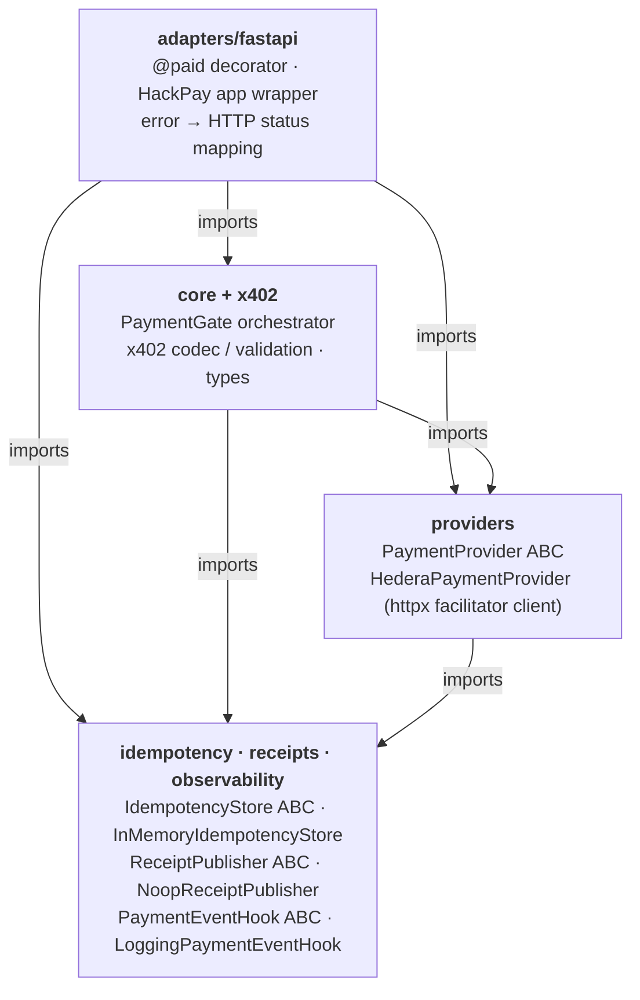
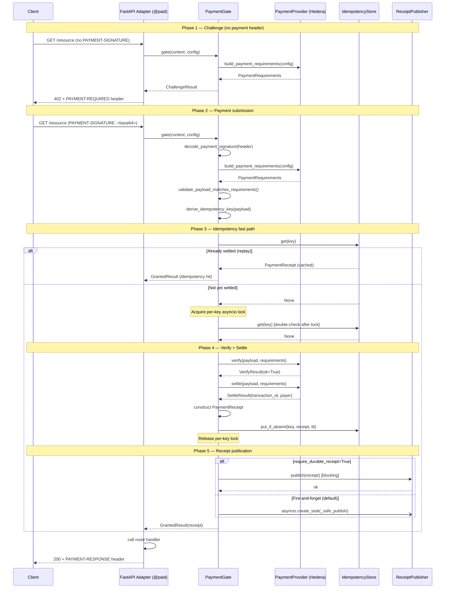

# ARCHITECTURE.md — hack_pay Library

This document describes the internal architecture of the `hack_pay` Python library — the open-source payment-gate component of the Hedera Agent Commerce Kit. It covers the layer model, import-dependency rules, the x402 payment flow, and key design decisions. It does **not** describe the full HACK SaaS platform (see `design.md` for that).

---

## 1. Layer Diagram

The library is organised into an outer adapter layer, orchestration/provider layers, and
foundation modules. Arrows below point from an importer to its dependency. Shared types such
as `core.types` and `x402.types` are foundation code available to both core and providers.



### Dependency rule: outer layers import inward toward foundation modules

| Layer | Allowed imports | Forbidden imports |
|---|---|---|
| `hack_pay.core` | stdlib, `errors`, `idempotency`, `observability`, `providers.base`, `receipts`, `x402` | `fastapi`, `starlette`, any chain SDK |
| `hack_pay.x402` | stdlib, pydantic, `errors` | `fastapi`, `starlette`, `httpx`, any chain SDK |
| `hack_pay.providers` | stdlib, `httpx`, `errors`, `core.types`, `x402.types` | `fastapi`, `starlette` |
| `hack_pay.adapters.fastapi` | everything above | nothing — this is the outermost layer |

---

## 2. Payment Flow Sequence Diagram



---

## 3. Component Descriptions

### Core

| Module | Responsibility | Key exports |
|---|---|---|
| `hack_pay/errors.py` | Full error hierarchy — every error carries a `code` string; HTTP adapters map codes to status. Zero framework imports. | `HackPayError`, `PaymentError`, `FacilitatorError`, `ReceiptError`, and all subclasses |
| `hack_pay/core/types.py` | Frozen dataclasses shared by all layers. No HTTP or chain SDK types may appear here. | `PaymentConfig`, `RequestContext`, `ChallengeResult`, `GrantedResult`, `ErrorResult`, `GateResult` |
| `hack_pay/core/gate.py` | `PaymentGate` — central payment orchestrator. Coordinates all phases (challenge, validate, idempotency, lock, verify, settle, receipt). Never raises — all errors become `ErrorResult`. | `PaymentGate` |

### x402 Protocol

| Module | Responsibility |
|---|---|
| `hack_pay/x402/types.py` | `PaymentRequirements`, `PaymentPayload`, `SettlementResponse` — wire-format types |
| `hack_pay/x402/codec.py` | Base64/JSON encode-decode for `PAYMENT-REQUIRED` and `PAYMENT-RESPONSE` headers |
| `hack_pay/x402/validation.py` | `validate_payload_matches_requirements()` — amount, recipient, asset, network, expiry checks |

### Providers

| Module | Responsibility |
|---|---|
| `hack_pay/providers/base.py` | `PaymentProvider` ABC: `initialize()`, `verify()`, `settle()`, `build_payment_requirements()`, `close()` |
| `hack_pay/providers/hedera/provider.py` | `HederaPaymentProvider` — default provider backed by a Hedera x402 facilitator |
| `hack_pay/providers/hedera/facilitator.py` | `httpx`-based HTTP client for the Blocky402/x402.org facilitator REST API |
| `hack_pay/providers/hedera/config.py` | `HederaProviderConfig` — network, receiver account, facilitator URL, timeouts |
| `hack_pay/providers/hedera/amounts.py` | `parse_hbar_string()`, tinybar arithmetic helpers |
| `hack_pay/providers/hedera/types.py` | Hedera-specific wire types for facilitator request/response |

### Infrastructure Abstractions

| Module | Responsibility |
|---|---|
| `hack_pay/idempotency/base.py` | `IdempotencyStore` ABC: `get()`, `put_if_absent()` |
| `hack_pay/idempotency/memory.py` | `InMemoryIdempotencyStore` — default, suitable for single-process deployments |
| `hack_pay/idempotency/keys.py` | `derive_idempotency_key(payload)` — deterministic key derivation from payment proof |
| `hack_pay/receipts/base.py` | `ReceiptPublisher` ABC: `is_available()`, `publish()` |
| `hack_pay/receipts/noop.py` | `NoopReceiptPublisher` — default no-op for deployments that don't need durable receipts |
| `hack_pay/receipts/types.py` | `PaymentReceipt` dataclass — settled transaction metadata |
| `hack_pay/observability/base.py` | `PaymentEventHook` ABC, `PaymentEvent` enum, `PaymentEventContext` |
| `hack_pay/observability/logging.py` | `LoggingPaymentEventHook` — structured `logging` output, added by default when no hooks are provided |

### Adapters

| Module | Responsibility |
|---|---|
| `hack_pay/adapters/fastapi/decorator.py` | `@paid("0.5 HBAR")` — FastAPI route decorator. Extracts `Request`, calls `PaymentGate`, returns 402 or injects `PAYMENT-RESPONSE` header. Only layer that imports `fastapi`. |
| `hack_pay/adapters/fastapi/app.py` | `HackPay` + `HackPayConfig` — wires all components, registers the gate on `app.state.hack_pay_gate` during `lifespan` startup |
| `hack_pay/adapters/fastapi/errors.py` | Maps `HackPayError` subclasses to appropriate HTTP status codes (400, 402, 429, 500, 503, 504) |

---

## 4. Error Hierarchy

```
HackPayError
├── ConfigurationError              CONFIGURATION_ERROR
├── PaymentError                    PAYMENT_ERROR
│   ├── MalformedPaymentError       MALFORMED_PAYMENT
│   ├── UnsupportedProtocolVersionError  UNSUPPORTED_PROTOCOL_VERSION
│   ├── InvalidPaymentError         INVALID_PAYMENT
│   ├── InsufficientPaymentError    INSUFFICIENT_PAYMENT
│   ├── RecipientMismatchError      RECIPIENT_MISMATCH
│   ├── AssetMismatchError          ASSET_MISMATCH
│   ├── NetworkMismatchError        NETWORK_MISMATCH
│   ├── ExpiredPaymentError         EXPIRED_PAYMENT
│   └── OversizedPaymentHeaderError OVERSIZED_PAYMENT_HEADER
├── FacilitatorError                FACILITATOR_ERROR
│   ├── FacilitatorUnavailableError      FACILITATOR_UNAVAILABLE
│   ├── FacilitatorTimeoutError          FACILITATOR_TIMEOUT
│   ├── FacilitatorNetworkNotSupportedError  FACILITATOR_NETWORK_NOT_SUPPORTED
│   └── FacilitatorInvalidResponseError  FACILITATOR_INVALID_RESPONSE
└── ReceiptError                    RECEIPT_ERROR
    └── DurableReceiptUnavailableError   DURABLE_RECEIPT_UNAVAILABLE
```

Every error carries a `code` string used for structured logging and programmatic handling. HTTP responses expose only the safe top-level `message` — never internal detail or stack traces.

---

## 5. Key Design Decisions

- **`core/gate.py` has zero HTTP and zero chain SDK imports.** All blockchain and framework knowledge lives in the `providers` and `adapters` layers respectively. This keeps the orchestration logic independently testable and portable to other frameworks or providers.

- **Adapters are the only framework-aware layer.** `fastapi` and `starlette` are imported exclusively in `adapters/fastapi/`. Every other layer is plain Python. Adding a new framework adapter (Flask, Django, ASGI middleware) requires no changes below the adapter layer.

- **All errors are wrapped — they never propagate raw to HTTP.** `PaymentGate.gate()` catches both `HackPayError` and bare `Exception`, wrapping them in `ErrorResult`. The adapter then calls `error_to_response()` to produce a structured HTTP error body with a safe `message` and machine-readable `code`.

- **Per-key asyncio locks prevent concurrent double-settlement.** Before calling `verify()` and `settle()`, the gate acquires an `asyncio.Lock` keyed on the idempotency key. A double-check against the idempotency store is performed both before and after acquiring the lock, eliminating the TOCTOU race under concurrent requests with the same payment proof.

- **Receipt publication is non-blocking by default.** Unless `PaymentConfig.require_durable_receipt=True`, receipt publishing is fire-and-forget via `asyncio.create_task()`. This keeps payment latency proportional to verify + settle time, not to the receipt backend. When durability is required, the gate blocks on `publisher.is_available()` before publishing and raises `DurableReceiptUnavailableError` if the backend is down.
